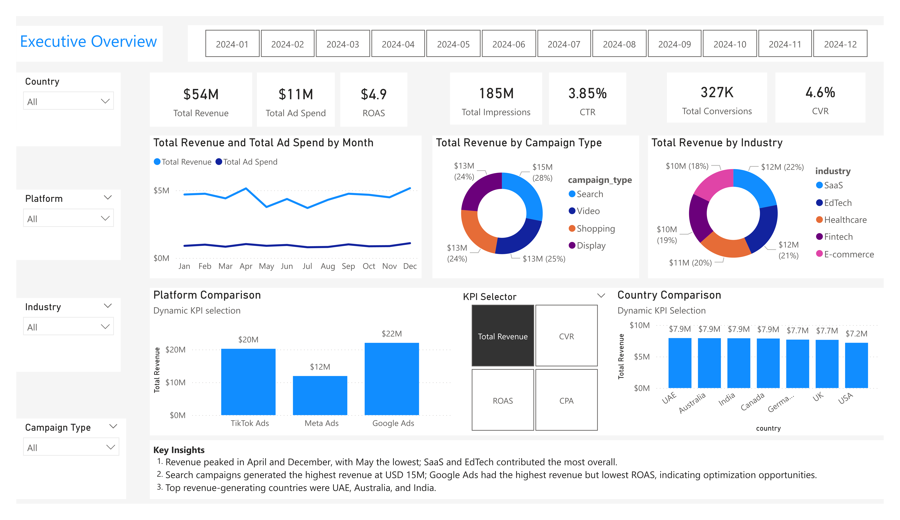
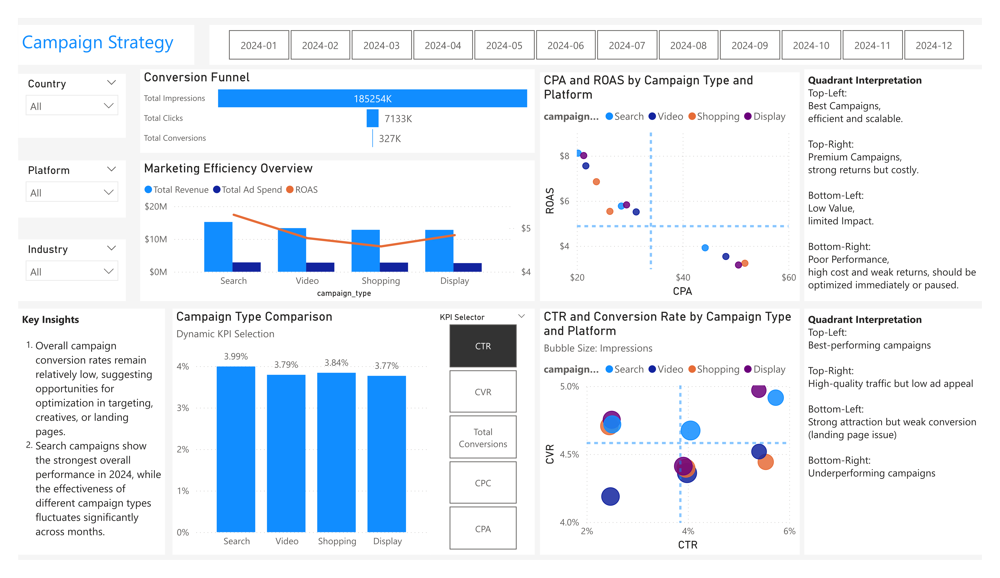
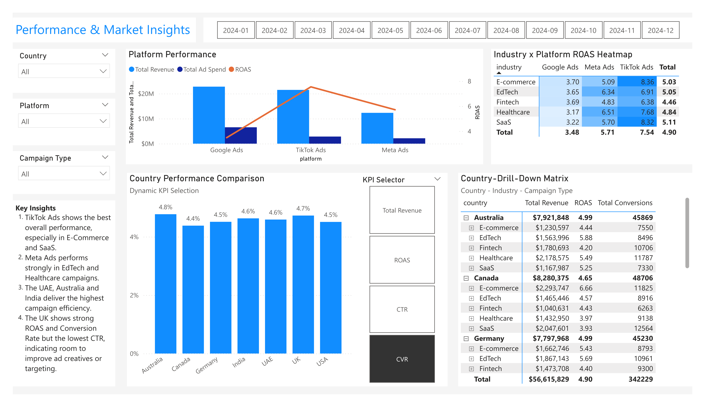

# Digital Marketing Analytics Project | SQL + Power BI Portfolio (End-to-End)

## Dashboard Preview

### 01-dashboard-executive-overview

### 02-dashboard-campaign-strategy

### 03-dashboard-performance-and-market-insights

---

## Project Description

This dashboard analyzes **online marketing campaigns** in 2024 for e-commerce products.  
It provides insights into campaign performance, platform efficiency, and regional outcomes.  

Key KPIs include **Impressions, Clicks, Conversions, CTR, ROAS, CVR, and CPA**.  
Analysis dimensions include **Date, Platform, Campaign Type, Country, and Industry**.

---

## Dashboard Structure

- **Executive Overview**  
- **Campaign Strategy**  
- **Performance & Market Insights**  

---

## End-to-End Workflow & Key Skills

### Workflow
Raw Data (CSV)  
→ Power Query (Data Cleaning & Transformation)  
→ SQL (Analytical Queries)  
→ Power BI (Modeling & Visualization)  
→ Business Insights

### Key Skills
- SQL (aggregation, joins, window functions)
- Power Query (data cleaning and transformation)
- Data Modeling (star schema)
- DAX (KPI and metrics calculation)
- Dashboard Design & Business Analysis

---

## Data Processing & SQL Analysis

Before building the Power BI dashboard, SQL was used to structure and analyze the raw dataset.

### Key SQL Analyses
- Data cleaning and staging (stg_ads view)
- KPI calculations (CTR, CPC, CPA, ROAS)
- Platform, campaign, country, and industry analysis
- Time trend analysis (monthly performance)
- Advanced analytics (Pareto, YoY growth, funnel analysis)

📁 All SQL scripts used in this project are available in the `/sql` directory for full reference.

---

## Data Preparation

- Data cleaning and transformation were primarily performed using Power Query
- SQL was used to support analytical queries
- Created a single fact table **Ad Performance** from raw data, consolidating all key performance metrics including impressions, clicks, ad spend, conversions and revenue.
- Removed redundant CTR, CPC, CPA, and ROAS columns from the fact table to streamline the model, then calculated these metrics dynamically using DAX measures in Power BI
- Created dimension tables for **Campaign Type, Platform, Country, Industry, and Date**  
- Added surrogate keys and mapped them to the fact table  
- Star schema with a single fact table connected to multiple shared dimension tables
- All KPI measures stored in the **Calculations folder** within Fact_Ad_Performance

---

## Business Insights

### Revenue & Campaign Trends
- Revenue peaked in **April and December**, with May the lowest.  
- **SaaS and EdTech** industries contributed most to overall revenue.  
- Search campaigns generated the **highest revenue (USD 15M)**; Google Ads had highest revenue but lowest ROAS.

### Platform & Campaign Performance
- **TikTok Ads** shows best overall performance, especially for E-Commerce and SaaS.  
- **Meta Ads** performs strongly in EdTech and Healthcare campaigns.  
- Campaign effectiveness varies month-to-month; conversion rates remain relatively low.

### Geographical Insights
- Top revenue-generating countries: **UAE, Australia, India**.  
- The **UK** has strong ROAS and Conversion Rate but low CTR, suggesting optimization opportunities.

---

## Features / Highlights

- Page slicers for dynamic filtering  
- KPI cards for key metrics  
- Field Parameters for dynamic switching between metrics and dimensions
- Dynamic scatter chart with quadrant analysis to evaluate and compare campaigns by plotting two key performance metrics at the same time
- Funnel visualizations for conversion analysis  
- Heatmap visualizations that use color intensity to emphasize performance patterns and support quick interpretation of business metrics
- Drill-down matrix (Country → Industry → Campaign Type)

---

## Data Source

- Kaggle: [Global Ads Performance (Google, Meta, TikTok) CSV)](https://www.kaggle.com/datasets/nudratabbas/global-ads-performance-google-meta-tiktok)
- The dataset used in this project can be found in the `/data` folder of this repository.

---

## Tech Stack

- Power BI Desktop  
- DAX  
- Power Query  
- Excel / CSV  
- GitHub

---

## Contact

GitHub: [GitHubProfile](https://github.com/yimengqi0826)  
Email: yimengqi99@gmail.com

