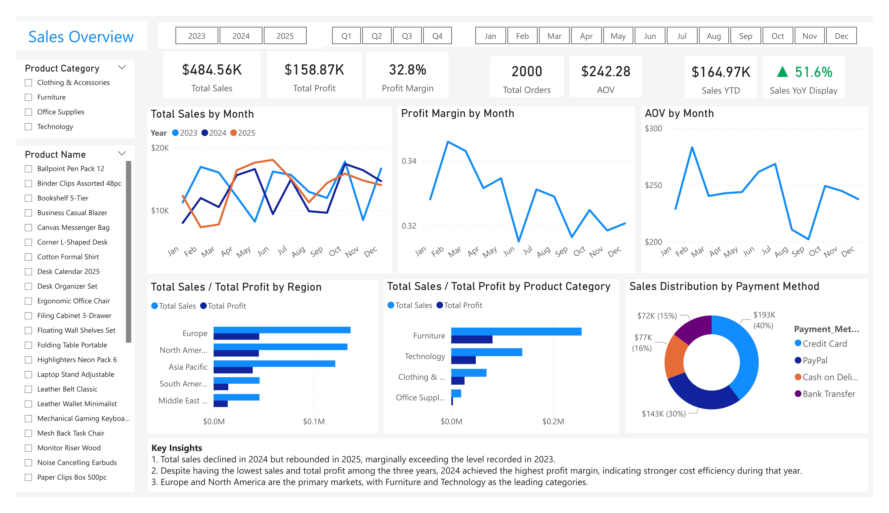
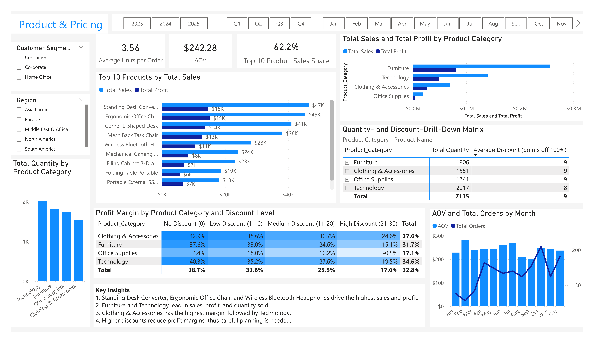
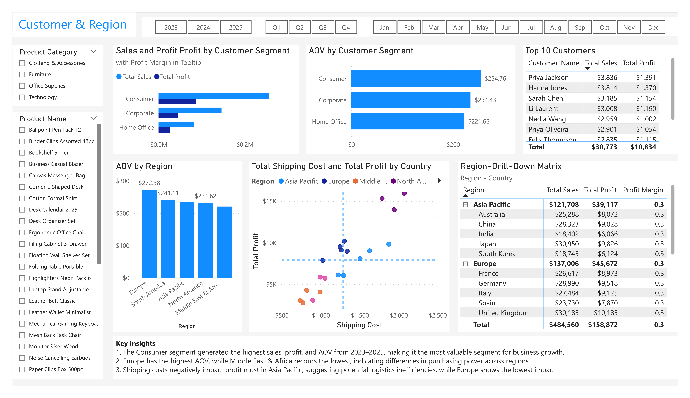
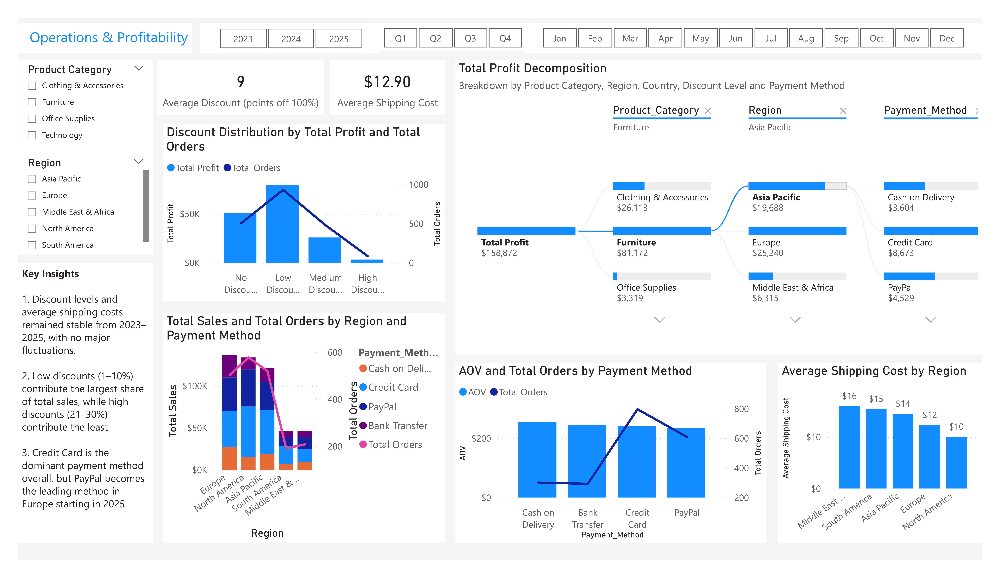

# E-Commerce Analytics Dashboard | Power BI Portfolio Project

## Dashboard Preview

### Sales Overview

### Product & Pricing

### Customer & Region

### Operations & Profitability

---

## Project Description

This dashboard analyzes global e-commerce sales performance from **2023 to 2025**.  
It provides insights into sales trends, product performance, customer behavior, and operational efficiency across regions.  

Key KPIs include **Total Sales, Total Profit, Profit Margin, Average Order Value (AOV), Average Discount, Sales YTD, and Sales YoY**.  
Analysis dimensions include **Date, Product, Customer Segment, Discount Level, and Payment Method**.

---

## Key Skills Demonstrated

- Data Transformation and Cleaning (Power Query)  
- Data Modeling (Star Schema)  
- DAX Measure Development  
- Interactive Dashboard Design  
- Business Insight Generation

---

## Business Insights

### Market & Sales
- Total sales declined in **2024** but rebounded in **2025**, slightly exceeding 2023 levels.  
- Despite lower sales volume, **2024 achieved the highest profit margin**, indicating stronger cost efficiency.  
- **Europe and North America** are the primary markets driving revenue.

### Product Performance
- **Furniture and Technology** lead in sales, profit, and quantity sold.  
- **Top products**: Standing Desk Converter, Ergonomic Office Chair, and Wireless Bluetooth Headphones.  
- **Clothing & Accessories** records the highest profit margin.

### Customer & Region
- The **Consumer segment** generates the highest sales, profit, and AOV.  
- **Europe** shows the highest AOV; **Middle East & Africa** the lowest.  
- Shipping costs impact profit most in **Asia Pacific**, suggesting potential logistics inefficiencies.

### Pricing & Operations
- Low discounts (1–10%) contribute the largest share of sales; high discounts (21–30%) contribute the least.  
- **Credit Card** is the dominant payment method; **PayPal** leads in Europe starting in 2025.

---

## Dashboard Structure

- **Sales Overview**  
- **Product & Pricing**  
- **Customer & Region**  
- **Operations & Profitability**

---

## Features / Highlights

- Page slicers for dynamic filtering  
- KPI cards for key metrics  
- Dynamic scatter chart with quadrant analysis to evaluate and compare campaigns by plotting two key performance metrics at the same time  
- Heatmap visualizations that use color intensity to emphasize performance patterns and support quick interpretation of business metrics  
- Decomposition Tree to analyze Total Profit drivers across multiple dimensions  
- Drill-down matrix (Country → Industry → Campaign Type) for hierarchical KPI analysis

---

## Data Source

- Kaggle: [Global E-Commerce Sales & Customer Data (CSV)](https://www.kaggle.com/datasets/muhammadaammartufail/global-e-commerce-sales-and-customer-data)
- The dataset used in this project can be found in the `/data` folder of this repository

---

## Data Preparation

- Classified discounts into **No/Low/Medium/High Discount** categories.  
- Created dimension tables for **Product, Customer, Payment Method, Discount Level**.  
- Removed duplicate records, added surrogate keys (Index Columns) and merged them into the fact table.  
- Created **Dim_Date** table using DAX.  
- Applied **currency formatting (USD)** for sales-related metrics.  
- Star schema data model: Fact_Sales linked to five dimension tables (one-to-many relationships).  
- Created DAX measures for all KPIs, stored in a **Calculations folder** within Fact_Sales.

---

## Tech Stack

- Power BI Desktop  
- DAX  
- Power Query  
- Excel / CSV  
- GitHub

---

## Contact

GitHub: [GitHubProfile](https://github.com/yimengqi0826)
Email: yimengqi99@gmail.com

